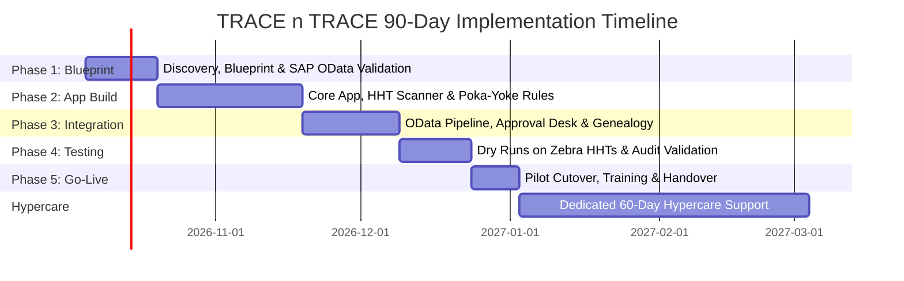

# TRACE n TRACE: Enterprise Digital Shop-Floor Execution & Genealogy System

**Client:** Hical Technologies Private Limited  
**Prepared By:** Lumbini Elite Solutions Private Limited  
**Practice Area:** SAP Manufacturing & Industrial Digitalization  
**Domain:** High-Reliability Aerospace, Defence & Industrial Electronics Discrete Manufacturing  
**Target Compliance:** AS9100D, MIL-STD, NADCAP  
**Document Classification:** Executive Commercial & Technical Proposal  
**Document Version:** 1.0 (Final Enterprise Board Edition)  
**Date:** October 2026  

---

## Executive "Tell, Show, Tell" Framework Summary

* **Opening Tell (Context & Strategic Vision):**  
  High-reliability discrete aerospace manufacturing requires absolute traceability and zero-defect execution. However, extending SAP directly onto the factory floor via standard SAP Fiori or mobile transactions introduces heavy licensing barriers, device rigidity, and grave database locking risks. Lumbini Elite presents **TRACE n TRACE**—a non-invasive, air-gapped shop-floor digital execution layer that eliminates paper travelers, enforces real-time Poka-Yoke, and captures 360° genealogy without executing a single direct write call to SAP.
* **The Show (Demonstrated Capability & Architecture):**  
  Using standard read-only OData endpoints (`API_PRODUCTION_ORDER_2_SRV`, `API_PURCHASEORDER_PROCESS_SRV`, `API_INSPECTIONLOT_SRV`), TRACE n TRACE extracts work order reservations, routing tolerances, and approved vendor lot criteria into an edge-resilient Progressive Web App on rugged Zebra/Honeywell handheld terminals. Barcode Poka-Yoke halts unauthorized assembly on the spot. Completed operations pass through a Two-Tier Digital Approval Desk (Supervisor PIN + QC Stamp) generating pre-verified "Ready-to-Post" slips indexed by SAP transaction code (`CO11N`, `MIGO`, `QE51N`).
* **Closing Tell (Recap of Proven Business Value):**  
  Zero risk to SAP database integrity, zero added SAP named user license costs across hundreds of operators, instant AS9100 audit compliance in under 15 seconds, and complete payback within 4 months through the total eradication of assembly rework and paper transcription backlog.

---

## Section 1: Executive Summary & Problem Context

### 1.1 Target Industry Dynamics: Aerospace & Defence Precision Discrete Manufacturing
[Hical Technologies](https://www.hical.com/) operates in one of the world's most unforgiving production environments—manufacturing high-reliability electromechanical systems, magnetic assemblies, precision motors, sensors, and cable harnesses under **AS9100D, ISO 9001, and MIL-STD** standards. 

Operating predominantly in **Make-to-Order (MTO)** and **Engineer-to-Order (ETO)** modes, Hical balances deep indented multi-level Bills of Materials (BOMs), frequent Engineering Change Notices (ECNs), strict serialized traceability, and customer-mandated Quality Inspection Plans. In this vertical, component substitution, drawing obsolescence, or unverified lot usage is not merely a defect—it results in catastrophic customer disqualification, aircraft grounding, or severe financial liquidated damages.

### 1.2 Core Operational Pain Points Solved

```
┌────────────────────────────────────────────────────────────────────────────────────────┐
│                        THE FOUR CRITICAL SHOP-FLOOR BOTTLENECKS                        │
├───────────────────────────────┬────────────────────────────────────────────────────────┤
│ 1. Paper Traveler Friction    │ Physical paper travelers wander through 8-15 assembly  │
│    & Transcription Latency    │ bays, gathering oil, tearing, and creating a 24-48 hr   │
│                               │ backlog during shift-end manual typing into SAP.       │
├───────────────────────────────┼────────────────────────────────────────────────────────┤
│ 2. Cost-Prohibitive SAP User  │ Equipping 150-300 floor operators with Named SAP Fiori │
│    Licensing Barrier          │ or Professional User Licenses costs ₹80L–₹1.5Cr+ in    │
│                               │ recurring OpEx, making native SAP deployment infeasible.│
├───────────────────────────────┼────────────────────────────────────────────────────────┤
│ 3. Assembly Error Vulnerability│ Manual visual checks fail to prevent assembling        │
│    (Missing Poka-Yoke)        │ unreleased batches, expired adhesives, or outdated ECN │
│                               │ drawing revisions, driving high Cost of Poor Quality.  │
├───────────────────────────────┼────────────────────────────────────────────────────────┤
│ 4. Transactional DB Locking   │ Direct shop-floor concurrent write-calls into live SAP │
│    & Data Corruption Risk     │ cause table lock contention in AUFM/AFRU and threaten  │
│                               │ ERP core stability during peak factory operations.     │
└───────────────────────────────┴────────────────────────────────────────────────────────┘
```

1. **Elimination of Physical Paper Travelers & Data Lag:** Today, routing work instructions and inspection check-sheets follow assemblies on printed job cards. Confirmation of operations into SAP occurs retroactively at shift-end or the following day. TRACE n TRACE digitizes the traveler entirely, clocking operator labor, tool IDs, and batch consumption in real time.
2. **Eradication of Excessive SAP Licensing Overheads:** Standard SAP implementations require purchasing expensive Named User licenses for every shop-floor assembler. TRACE n TRACE decouples shop-floor execution from SAP licensing: operators interact with rugged industrial tablets/scanners operating on open standards, while SAP requires only a **single read-only system communication interface**.
3. **Automated Barcode Poka-Yoke (Error-Proofing):** Human operators under delivery pressure occasionally mount an incorrect capacitor, pull an unreleased batch of wire, or assemble against an outdated drawing revision. TRACE n TRACE enforces hardware-level barcode scanning at every assembly step. If a scanned component does not match the active production reservation or approved manufacturer list, the terminal triggers a hard stop.
4. **Decoupled System of Record without Direct ERP Exposure:** SAP remains Hical’s inviolable Financial & Supply Chain System of Record. TRACE n TRACE acts as the dynamic Operational Execution Layer, buffering, validating, and structuring floor movements before posting.

---

## Section 2: Architectural Framework & Technical Flow

### 2.1 Non-Invasive Architecture Blueprint

TRACE n TRACE is built on a **100% Non-Invasive, Read-Only, Decoupled Architecture**. It does not write directly to live SAP database tables (`AFKO`, `AFRU`, `MSEG`, `ACDOCA`), preventing deadlocks, background job failures, or schema corruption.

```
┌──────────────────────────────────────────────────────────────────────────────────┐
│                             SAP S/4HANA / ECC CORE                               │
│  • Purchasing (EKKO/EKPO)  • Production (AFKO/RESB)  • Quality Lots (QALS/PLMK)  │
└────────────────────────────────────────┬─────────────────────────────────────────┘
                                         │ HTTPS / TLS 1.3 (Standard OData GET Only)
                                         ▼
┌──────────────────────────────────────────────────────────────────────────────────┐
│              ENTERPRISE API GATEWAY & SECURE MIDDLE-TIER SERVICE                 │
│  • Token Authentication & Rate Limiting                                          │
│  • Timestamp Delta Synchronization ($filter=LastChangeDateTime ge ...)           │
│  • Local PostgreSQL High-Performance Relational & As-Built Graph Database        │
└───────────────────▲──────────────────────────────────────────┬───────────────────┘
                    │                                          │ WebSocket / REST
                    │ Bi-Directional Sync                      │ (Online / Offline Edge)
                    ▼                                          ▼
┌──────────────────────────────────────┐     ┌─────────────────────────────────────┐
│  TWO-TIER OPERATIONAL APPROVAL DESK  │     │   TRACE n TRACE HANDHELD CLIENT     │
│  • Supervisor Shift Validation       │     │   • Rugged Zebra / Honeywell HHT    │
│  • QC Precision Parameter Sign-Off   │     │   • 1D/2D Hardware Barcode Wedge    │
│  • Automated Discrepancy Highlighting│     │   • Embedded SQLite Offline Cache   │
└───────────────────┬──────────────────┘     └─────────────────────────────────────┘
                    │ Dual Digital Stamp Complete
                    ▼
┌──────────────────────────────────────────────────────────────────────────────────┐
│             AIR-GAPPED "READY-TO-POST" SAP STAGING & SUMMARY ENGINE              │
│  • Generates Verified Transaction Posting Slips indexed by SAP T-Code:           │
│     - CO11N: Production Confirmation (Actual Cycle Time, Scrap, Operator ID)     │
│     - MIGO (261/101): Backflush Goods Issue & Finished Goods Receipt             │
│     - QE51N: In-Process Quality Results Recording                                │
│  • Manual Dual-Review or Automated RFC Batch Inward via Authorized Terminal      │
└────────────────────────────────────────┬─────────────────────────────────────────┘
                                         │
                                         ▼
                       [ SAP CORE REMAINS 100% UNHARMED ]
```

### 2.2 Read-Only SAP OData Consumption Specifications

TRACE n TRACE consumes data through standard, SAP-certified RESTful OData services using HTTP `GET` verbs exclusively:

| Functional Domain | Standard SAP OData Service | Specific Entities & Fields Consumed | Operational Use in TRACE n TRACE |
| :--- | :--- | :--- | :--- |
| **Procurement & Inbound** | `API_PURCHASEORDER_PROCESS_SRV` | `A_PurchaseOrder`, `A_PurchaseOrderItem`<br>*(PO Number, Item, Material, Vendor ID, Drawing Rev, Target Qty, Plant, Storage Loc)* | Inbound kitting verification against approved supplier lot & material barcode. |
| **Production & Routing** | `API_PRODUCTION_ORDER_2_SRV` | `A_ProductionOrder_2`, `A_ProductionOrderOperation_2`, `A_ProductionOrderComponent_2`<br>*(Order ID, Op Number, Work Center, Setup/Machine Time, Material Reservation `RESB`, BOM Explosion, Valid ECN Revision)* | Populates the Digital Traveler, routing sequences, required component batches, and cycle time baselines. |
| **In-Process Quality** | `API_INSPECTIONLOT_SRV` | `A_InspectionLot`, `A_InspectionCharacteristic`<br>*(Inspection Lot ID, Char ID, Char Text, Upper/Lower Spec Limits, Qualitative Check Codes, Sampling Size)* | Renders digital inspection gates, forcing operators to record critical dimensional and electrical readings. |
| **Inventory & Stock** | `API_PHYSICAL_INVENTORY` / Custom Read-Only CDS View | `I_MaterialStock`<br>*(Material, Batch, Plant, SLoc, Unrestricted Qty, Quality Stock, Special Stock `E`/`Q`)* | Validates inventory availability and lot release status prior to issuing parts into assembly kits. |

### 2.3 Technical Security & Edge Query Mechanics
- **Least-Privilege Security:** The middle tier connects to SAP via a dedicated technical communication user (`TRACE_SVC_USER`) assigned strictly to read-only authorizations (Authorization Activity `03` [Display]). All create/change activities (`01`, `02`, `06`) are revoked in SAP PFCG profiles.
- **Timestamp Delta Synchronization:** To guarantee near-zero CPU overhead on the SAP application server, queries use temporal delta polling:
  ```http
  GET /sap/opu/odata/sap/API_PRODUCTION_ORDER_2_SRV/A_ProductionOrder_2?$filter=LastChangeDateTime ge datetimeoffset'2026-10-01T06:00:00Z' and Plant eq '1000'&$expand=to_ProductionOrderOperation,to_ProductionOrderComponent
  ```
- **Rugged Edge-Buffering for Cleanrooms & RF-Shielded Chambers:** Hical’s motor test bays and cleanrooms frequently suffer from Wi-Fi dropouts. Handheld terminals run an embedded **SQLite edge cache**. Operators continue scanning, verifying barcodes, and logging traveler data seamlessly while offline; records automatically sync to the PostgreSQL middle tier the instant network connectivity is re-established.

---

## Section 3: Functional Scope & Operational Approval Workflow

### 3.1 Core Modules Breakdown

```
[ Module A: Inbound & Kitting ] ────► [ Module B: Digital Traveler ] ────► [ Module C: Poka-Yoke ]
                                                                                   │
[ Module E: Defect & Rework ]   ◄──── [ Two-Tier Approval Desk ]    ◄──── [ Module D: 360° Genealogy ]
```

#### Module A: Digital Inbound & Kitting Verification
- **PO-to-Package Verification:** Scans vendor barcodes upon dock arrival, cross-referencing material code, manufacturer part number (MPN), and purchase order schedule line.
- **BOM Kitting Cart Validation:** Validates that picking bins for assembly kits contain the exact components, quantities, and released batch numbers required by the target production order.
- **Shortage & Substitution Alert:** Flags missing hardware or unapproved material substitutions before the kit leaves the kitting staging area.

#### Module B: Operator Digital Traveler (The Paperless Bay)
- **Live Electronic Job Card:** Replaces multi-page laminated paper travelers with an intuitive, touch-optimized interface designed for gloved operation.
- **Touchless Clock-On / Clock-Off:** Scans operator badge to log actual setup and run time per operation step, capturing precise labor hours.
- **Step-by-Step SOP Presentation:** Displays approved engineering work instructions, high-resolution wiring schematics, and torque specifications at each workstation.
- **Dynamic Parameter Logging:** Records process values (e.g., winding resistance, potting oven temperature, curing duration, crimp pull-force) with instantaneous tolerance checking.

#### Module C: Aerospace Barcode Poka-Yoke (Hard-Stop Quality Gates)
- **Batch Release Verification:** Blocks components tagged as "In Quality Quarantine" or "Scrapped" in SAP from being consumed.
- **Drawing & ECN Revision Enforcer:** Compares the drawing revision on the physical component label against the active production order BOM revision, eliminating outdated parts usage.
- **Potting & Chemical Shelf-Life Sentinel:** Validates expiration dates on epoxy, potting compounds, adhesives, and solder paste, disallowing scanned lots past expiration.
- **Immediate Terminal Lockout:** If an incorrect component barcode is scanned, the terminal emits an audible alarm, flashes red, and locks the workflow until supervisor intervention.

#### Module D: 360° Bi-Directional Genealogy Graph
- **Downstream Traceability (Top-Down):** Enter a Finished Good Serial Number (e.g., an aircraft motor actuator) to instantly generate an interactive tree revealing every subassembly, internal winding lot, raw wire batch, mil-spec connector, vendor PO, heat number, and the technician who assembled each step.
- **Upstream Traceability (Bottom-Up):** Enter a vendor raw material lot number (e.g., a specific batch of copper magnet wire) to identify every semi-finished and finished serialized unit containing that wire across active work orders, warehouse inventory, and customer dispatches within 5 seconds.

#### Module E: Defect & Non-Conformance Rework Routing Engine
- **Non-Conformance Report (NCR) Logging:** Instant defect logging with photographic evidence capture via handheld camera.
- **Dynamic Rework Sub-Operations:** Generates authorized rework branches without disrupting the parent production order in SAP.
- **Scrap Disposition Control:** Segregates rejected material physically and digitally, tracking scrap reasons and cost center attribution.

---

### 3.2 Two-Tier Operational Approval Desk & SAP "Ready-to-Post" Slips

To maintain absolute data integrity and respect enterprise segregation of duties, TRACE n TRACE introduces an **Air-Gapped Two-Tier Approval Gate** before any transactional entry is made into SAP:

```
[ Step 1: Shop-Floor Execution ]
Assembler completes assembly steps, logs parameters, scans serials, and hits "Submit for Review".
                           │
                           ▼
[ Step 2: Tier 1 - Production Supervisor Sign-Off ]
Shift Supervisor inspects terminal package, verifies cycle times, operator attendance, and labor actuals.
Authorizes via Digital Signature / PIN.
                           │
                           ▼
[ Step 3: Tier 2 - Quality Control (QC) Gatekeeper ]
QC Inspector validates dimensional measurements, electrical test readings, calibration logs, and visual standards.
Affixes Cryptographic QC Digital Stamp.
                           │
                           ▼
[ Step 4: System Compiles "Ready-to-Post" Operational Slips ]
System compiles an air-gapped summary indexed strictly by SAP Transaction Code:
   ├── Slip Type A: CO11N (Order #, Op #, Confirmed Qty, Scrap Qty, Setup/Machine/Labor Actuals)
   ├── Slip Type B: MIGO Mov 261/101 (Material Numbers, Issued Batches, SLoc, FG Serial ID)
   └── Slip Type C: QE51N (Inspection Lot #, Sample Readings, Qualitative Evaluation Pass/Fail)
                           │
                           ▼
[ Step 5: Clean Inward Entry to SAP GUI ]
Authorized SAP Clerk opens SAP GUI, loads pre-validated slip, and books posting with 100% first-pass accuracy.
(Zero typing errors, zero reconciliation lag, zero live DB locks).
```

---

## Section 4: Implementation Methodology & Milestones (90-Day Plan)

Lumbini Elite utilizes a structured **Agile-Stage-Gate Methodology** spanning 90 calendar days from Kickoff to Production Go-Live, followed by 60 calendar days of comprehensive Hypercare support.



### Detailed Phase Breakdown

| Phase | Duration | Core Deliverables & Activities | Milestone Sign-Off Gate |
| :--- | :---: | :--- | :--- |
| **Phase 1: Discovery & Blueprinting** | Days 1–15 | • Shop-floor physical walk-through across Hical manufacturing cells.<br>• SAP OData read endpoint connectivity testing (`API_PRODUCTION_ORDER_2_SRV`, etc.).<br>• Technical Architecture Document (TAD) & Functional Requirement Spec (FRS). | **Milestone 1:** Architecture & Blueprint Sign-Off (20% Payment). |
| **Phase 2: Core Application Development** | Days 16–45 | • PWA/Android APK build for rugged Zebra/Honeywell handheld terminals.<br>• Barcode wedge engine configuration (Code 128, DataMatrix, QR).<br>• Local SQLite edge database buffering and offline sync logic.<br>• Hard-stop Poka-Yoke business logic implementation. | **Milestone 2:** Core Application Alpha Review (30% Payment). |
| **Phase 3: Integration & Approval Desk** | Days 46–65 | • Middleware ingestion pipeline connecting SAP OData to PostgreSQL.<br>• Two-Tier Supervisor & QC Approval Desk web workbench.<br>• Automated generation of SAP Ready-to-Post slips (`CO11N`, `MIGO`, `QE51N`).<br>• 360° Bi-directional genealogy graph indexing. | **Beta Validation:** System Integration Walkthrough. |
| **Phase 4: Pilot Dry-Runs & UAT** | Days 66–80 | • Shop-floor pilot on 2 representative assembly lines (Motors & Harnessing).<br>• Dry-run stress testing on 15+ Zebra handheld terminals.<br>• AS9100 Mock Traceability Audit (simulating 15-second retrieval).<br>• User Acceptance Testing (UAT) with production and quality leads. | **Milestone 3:** Formal Business UAT Sign-Off (30% Payment). |
| **Phase 5: Cutover & Go-Live** | Days 81–90 | • Production deployment on Hical on-premise VM / private server.<br>• Shift-wise training for 50+ operators, supervisors, and QC inspectors.<br>• Standard Operating Procedure (SOP) documentation & admin handover.<br>• Commercial go-live and transition to hypercare. | **Milestone 4:** Final Production Go-Live (20% Payment). |
| **Post-Go-Live Hypercare** | Days 91–150 | • **60 Calendar Days of Dedicated Hypercare** (On-site & remote support).<br>• Daily stabilization standups, query performance tuning, and operator coaching. | Hypercare Completion Certificate. |

---

## Section 5: Commercial Proposal

Lumbini Elite structures this engagement under a transparent, fixed-price turnkey model for implementation, backed by a flexible Time & Materials (T&M) framework for ongoing maintenance.

### 5.1 Fixed-Price Implementation Investment

$$\mathbf{₹28,50,000 \text{ INR (Twenty-Eight Lakhs Fifty Thousand Indian Rupees)}}$$
*(Taxes extra as applicable under prevailing Goods & Services Tax [GST @ 18%]).*

#### Cost Allocation Breakdown:

| # | Commercial Component | Scope Description | Investment (INR) |
| :-: | :--- | :--- | :---: |
| **1** | **Application & Platform Development Cost** | • End-to-end custom TRACE n TRACE application software.<br>• Handheld terminal scanning app (Zebra/Honeywell optimized PWA/APK).<br>• Two-Tier Supervisor & QC Approval Desk workbench.<br>• 360° Bi-directional genealogy engine and local PostgreSQL database.<br>• Edge SQLite offline buffer and device hardening. | **₹18,50,000** |
| **2** | **SAP Integration & Middle-Tier Services Cost** | • Read-only SAP OData endpoint configuration and connectivity.<br>• Delta synchronization pipeline ($filter mechanics).<br>• Data translation layer mapping SAP BOMs and routings to shop floor.<br>• Ready-to-Post Slip compiling engine (`CO11N`, `MIGO`, `QE51N`).<br>• AS9100 audit compliance validation and end-to-end UAT. | **₹10,00,000** |
| | **Total Fixed Implementation Investment** | **Complete Turnkey Deployment + 60-Day Hypercare** | **₹28,50,000** |

---

### 5.2 Milestone-Based Payment Structure

Payment obligations are linked strictly to tangible project deliverables:

```
[ Milestone 1: 20% (₹5,70,000) ] ──► Project Mobilization & Blueprint Sign-Off (Day 15)
[ Milestone 2: 30% (₹8,55,000) ] ──► Core Application & Poka-Yoke Engine Complete (Day 45)
[ Milestone 3: 30% (₹8,55,000) ] ──► Integration Testing & Shop-Floor UAT Sign-Off (Day 80)
[ Milestone 4: 20% (₹5,70,000) ] ──► Production Go-Live, Training & System Handover (Day 90)
```

- **Milestone 1 (20% — ₹5,70,000):** Mobilization advance upon contract signing and approved Architecture Blueprint.
- **Milestone 2 (30% — ₹8,55,000):** Completion of handheld scanner application and standalone Poka-Yoke validation.
- **Milestone 3 (30% — ₹8,55,000):** Completion of middle-tier OData integration and formal shop-floor UAT acceptance.
- **Milestone 4 (20% — ₹5,70,000):** Production cutover, operator training sign-off, and commencement of 60-day hypercare.

---

### 5.3 Post-Implementation Support (AMS Framework)
- **Complimentary 60-Day Hypercare:** Included within the fixed implementation fee with zero additional billing.
- **Ongoing Annual Maintenance Support (AMS):** Commencing on Day 151, support is provided under a **Time & Material (T&M) Retainer Model** billed quarterly based on consumed effort hours.
- **Guaranteed Service Level Agreement (SLA) Tiers:**
  * **Priority 1 (Critical Production Halt):** Initial Response within **2 Hours**; Temporary Workaround within **6 Hours**.
  * **Priority 2 (High - Core Feature Degradation):** Initial Response within **4 Hours**; Resolution within **16 Hours**.
  * **Priority 3 (Medium - General Support / Queries):** Initial Response within **8 Hours**; Resolution within **3 Business Days**.

---

## Section 6: Assumptions, Dependencies & Commercial Terms

### 6.1 Client Dependencies (Hical Technologies)
1. **SAP Service Exposure:** Hical IT will expose standard or custom SAP read-only OData services with HTTPS network accessibility to the TRACE n TRACE middle tier.
2. **Environment Access:** Provisioning of SAP Sandbox/Quality systems populated with representative master data (active BOMs, routings, and inspection plans for discrete electromechanical assemblies) within 5 days of kickoff.
3. **Hardware & Infrastructure:** Hical to supply required rugged handheld terminals (Zebra TC26/TC57 or Honeywell ScanPal series) and guarantee robust Wi-Fi coverage across target assembly bays.
4. **Stakeholder Availability:** Designated Single Point of Contact (SPOC) and key production/quality leads available for scheduled Phase 1 discovery and Phase 4 UAT sessions.

### 6.2 Key Project Assumptions
1. **Strictly Non-Invasive:** SAP remains 100% read-only throughout the engagement. TRACE n TRACE will not deploy custom ABAP write-back tables, direct RFC write destinations, or background BAPIs.
2. **Posting Authority:** The ultimate business decision and physical posting of production confirmations (`CO11N`) and goods receipts (`MIGO`) into SAP GUI remain under the operational authority of Hical’s authorized personnel using the generated Ready-to-Post slips.
3. **Data Hygiene:** Master data residing in SAP (material numbers, BOM revisions, and vendor details) is assumed to be structurally maintained by Hical internal teams.

### 6.3 Commercial Terms & Conditions
1. **Proposal Validity:** Commercial pricing is valid for **45 calendar days** from the date of submission.
2. **Taxation:** All figures are quoted exclusive of statutory taxes. Prevailing Goods & Services Tax (GST @ 18%) applies extra.
3. **Payment Terms:** Milestone invoices are payable within **15 business days** of electronic presentation following formal milestone acceptance.
4. **Intellectual Property:** Complete source code for the custom middle-tier and handheld application, along with all configuration scripts and documentation, transfers exclusively to Hical Technologies upon receipt of final milestone settlement.
5. **Confidentiality:** Both parties remain bound by mutual Non-Disclosure Agreements protecting all technical schematics, pricing models, and operational secrets.

---

## Section 7: Strategic Win Themes & Return on Investment (ROI)

```
┌────────────────────────────────────────────────────────────────────────────────────────┐
│                        TANGIBLE ANNUAL VALUE CREATION FOR HICAL                        │
├───────────────────────────────────────┬────────────────────────────────────────────────┤
│ 1. SAP Licensing Cost Avoidance       │ ₹45,00,000 – ₹75,00,000                        │
│    (Eliminating 150 Named Fiori Users)│ Avoided upfront and recurring annual license fees│
├───────────────────────────────────────┼────────────────────────────────────────────────┤
│ 2. Scrap & Assembly Rework Eradication│ ₹28,00,000 – ₹42,00,000                        │
│    (Zero-Defect Barcode Poka-Yoke)    │ Preventing component mix-ups & obsolete ECNs   │
├───────────────────────────────────────┼────────────────────────────────────────────────┤
│ 3. Paperless Traveler Labor Recovery  │ ₹15,00,000 – ₹22,00,000                        │
│    (Eliminating Shift-End Data Entry) │ 1.5 hours recovered per supervisor per shift   │
├───────────────────────────────────────┼────────────────────────────────────────────────┤
│ 4. Audit Defense & Penalty Avoidance  │ ₹20,00,000 – ₹35,00,000                        │
│    (15-Second AS9100 Traceability)    │ Protecting aerospace contracts from audit holds│
├───────────────────────────────────────┼────────────────────────────────────────────────┤
│ TOTAL ESTIMATED ANNUAL ECONOMIC VALUE │ ₹1,08,00,000 – ₹1,74,00,000                    │
│ PROJECT PAYBACK PERIOD                │ 3.5 to 4.5 Months (ROI: 3.8x – 6.1x in Year 1) │
└───────────────────────────────────────┴────────────────────────────────────────────────┘
```

### Closing Executive Recap:
TRACE n TRACE delivers what traditional ERP extensions cannot: **true shop-floor digital agility and zero-defect quality enforcement without ERP licensing penalties, without complex ABAP custom code, and without risking the stability of Hical’s live SAP core**. 

Lumbini Elite is prepared to deploy our engineering team and initiate Phase 1 Discovery within 7 business days of authorization.
